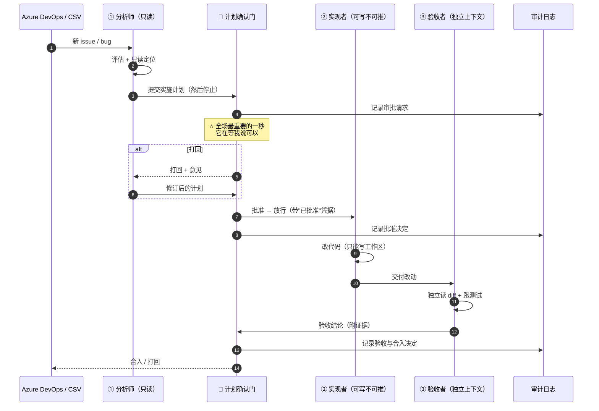

# 02 · 三人团队设计

> **分享第 ② 段的核心内容，也是整场"可复制"的载体。**
> 目标：听众离场时能复述出"三个人 + 一道门"。

---

## 一、一句话定义

> 一个**想清楚**，一个**做出来**，一个**挑毛病**。
> 前两个不能是同一个人；第三个不能是前两个中的任何一个。

再加一道门：

> **动手之前，计划必须有人点头。**

---

## 二、编制表

| | 岗位 | 戴哪些帽子 | 权限 | 停止条件 |
|---|---|---|---|---|
| ① | **分析师** Analyst | 接单 → 评估 → 分析 → **出计划** | **只读** | 出完计划**必须停** |
| ② | **实现者** Builder | 按已批准的计划开发 | 可写工作区，**不可推送** | 干完停 |
| ③ | **验收者** Verifier | 读 diff 复查 + 跑测试验证 | 只读 + 只能跑命令，**独立上下文** | 出结论 |
| 🧑 | **你**（审批门） | 批计划、批合入 | **唯一合入权** | — |

> 🧑 **你不在编制内，你是那道门。** 前三行是团队，最后一行是团队存在的条件。

**关键澄清（如果有人问）**：岗位少 ≠ 步骤少。
流程还是七步「接单 → 评估 → 分析 → 计划 → **确认** → 开发 → 验收」，只是由**三个人轮流戴帽子**。
砍的是"岗位"，不是"步骤"。

---

## 三、权限矩阵（分享现场必停在这一页）

| 能力 | 分析师 | 实现者 | 验收者 | 🧑 你 |
|---|:---:|:---:|:---:|:---:|
| 读代码 / 读工单 | ✅ | ✅ | ✅ | ✅ |
| 写文件 | ❌ | ✅ **仅工作区** | ❌ | ✅ |
| 跑命令 | ❌ | ✅ | ✅ **仅测试与验证** | ✅ |
| 提交（commit） | ❌ | ❌ | ❌ | ✅ |
| 推送（push） | ❌ | ❌ | ❌ | ✅ |
| 合入（merge） | ❌ | ❌ | ❌ | ✅ |
| 批准计划 | ❌ | ❌ | ❌ | ✅ |

**这张表想说的三件事**：

1. **能造成损害的面积被压到最小**——前三个岗位里有两个完全只读，唯一能写的那一个写了也推不出去。
2. **权限不是靠 prompt 请求的，是运行时强制的**。你可以在提示词里写一万遍"请不要改动生产配置"，那只是请求；真正的边界是沙箱和审批 seam。
3. **人只有一个特权：合入。** 其余全是可回收的。

---

## 四、那道硬门：计划确认（本段高潮）

### 三个不变式

> **I1 · 计划未获批准，实现阶段不会开始。**
> 机制上：**把"启动实现者"这一步本身置于审批 seam 之下**。没有应答者 → 返回 `unavailable` → **以拒绝方式关闭** → 实现者根本起不来。
> 注意：这**不是**"实现者收到计划后自己判断该不该做"——**判断权不在它手上**。

> **I2 · 没有应答者，就拒绝。**
> 不是"没人管就默认通过"。是 fail-closed——**缺人点头 = 不许动手**。
>
> **I3 · 批准是一次性的，而且是留痕的。**
> 这次批了不代表下次自动批。每一次请求、每一个决定，都进审计日志。

### ⚠️ 一处最容易讲错的细节（务必分清）

`03` 的脚本骨架里有一句 `if (args.approved !== true) return ...`。
**那只是"把批准结果带进编排"的形式，不是强制点。**

> **真正的拒绝发生在运行时**：审批 seam 在**工具调用层**拦截——只要把"启动实现者"这一步纳入它的管辖，脚本写不写那个 `if` 都拦得住；反过来，如果没纳入管辖，脚本里写十个 `if` 也没用。

**台上就说这一句**：

> **"门是运行时拦的，不是脚本自觉遵守的。"**

### 为什么这道门比"让 agent 更聪明"更值钱

一个只会往前冲的 agent，你必须**全程盯着**它，那它并没有解放你。
一个**知道在哪停**的 agent，你才敢去干别的事。

> **可控性不是智能的附属品，是智能能被使用的前提。**

### 映射到 DSH 原语（🟢 现在就能用）

| 门的组成部分 | DSH 原语 | 它实际做什么 |
|---|---|---|
| 把计划呈交给人批准 | `dsh-plan-mode` | agent 先探索设计，再通过 `exit_plan_mode` 把计划交出；你批准才继续 |
| 卡住、等人、留痕、拒绝时关闭 | `dsh-user-approval` | 一次性审批 seam。`ask` 策略把请求交给应答者；**每个请求与结果都记入发起会话的审计日志**；应答者缺失或失败时返回 `unavailable`，**以拒绝方式关闭** |
| 独立上下文（写的人 ≠ 审的人） | `dsh-subagent` | subagent 是独立会话，看不到实现者的推理过程 |
| 权限分级 | `dsh-permission-presets` · `dsh-sandbox-policy` · `dsh-fs-sandbox` | 只读 / 可写 / 命令白名单，在运行时强制 |
| 留痕与可恢复 | `dsh-session-persistence-jsonl` · `dsh-session-checkpoint-policy` | 会话落盘，可回放、可恢复 |

---

## 五、怎么建：团队是怎么组装出来的

### 5.1 ★ 创建 team member 的三层机制

**一个岗位不是"新建一个 agent"，而是三层叠出来的。**

| 层 | 机制 | 决定什么 |
|---|---|---|
| **① 岗位定义** | **agent preset** | 这个岗位**是谁**、会什么、带哪些**专属技能** |
| **② 权限** | **permission preset** | 它**能碰什么**、要不要人批 |
| **③ 实例化** | **具名 subagent 工具实例** | **这一次**起谁、什么人格、哪个模型 |

> **为什么要拆三层？** 因为把"它是谁"和"它能干什么"分开，**权限才管得住**。

#### ① agent preset —— 岗位说明书

一个 preset 就是一个目录，核心是 `agent.cordis.yml`，写三样：

> **该岗位的工具 + 提示词段落 + 它自己的 skill 目录**

```yaml
- name: '@deepseek-ai/dsh-agent-presets'
  config:
    default: standard
    roots:
      - path: ~/company-presets      # 你自己的团队目录
        trust: system
```

| 事实 | 值 |
|---|---|
| 用户级目录 | `<dshHome>/.agent-presets`（本机 `~/.dsh/.agent-presets`） |
| 创建方式 | **复制一个现有 preset 的整个目录**（组装、元数据、**技能目录**、资产） |
| id 规则 | `[a-z0-9][a-z0-9-]*`（会成为目录名）；已占用的 id **不会被覆写** |
| 切换限制 | ⚠️ **只有空会话可以切换 preset** |
| ⚠️ 关键约束 | **子 agent 会加入其父方的组装**——所以**不能靠 preset 给单个 subagent 换岗** |

#### ② permission preset —— 权限

把**沙箱模式**与**审批策略**捆成一个名字，用 `/permission` 切换：

```yaml
- name: '@deepseek-ai/dsh-permission-presets'
  config:
    presets:
      read-only:          { sandbox: read-only,          approval: ask }
      workspace-write:    { sandbox: workspace-write,    approval: ask }
      danger-full-access: { sandbox: danger-full-access, approval: never }
    defaultPreset: workspace-write
```

- 内置两档：`workspace-write`、`danger-full-access`
- **创建会话时读取 `defaultPreset`**；之后的改动**不影响已在运行的会话**

#### ③ 具名 subagent 工具实例 —— 真正的"创建成员"

`dsh-tool-subagent` **每挂一个实例就多一个工具**，实例的 `toolName` 必须唯一。

```yaml
# 分析师：只读
- name: '@deepseek-ai/dsh-tool-subagent'
  config:
    provider: spawn
    toolName: analyst
    persona: |
      你是分析师。只做三件事：评估、定位、出计划。
      绝不能修改任何文件。产出必须是结构化计划。
    toolFilter: [read_file, search, list_files]
    maxDepth: 0

# 实现者：可写工作区，不可推送
- name: '@deepseek-ai/dsh-tool-subagent'
  config:
    provider: spawn
    toolName: builder
    persona: |
      你是实现者。只能执行一份"已被批准"的计划。
      拿到计划前不得动手。可改工作区文件，不得提交、不得推送。
    toolFilter: [read_file, search, write_file, run_tests]
    maxDepth: 0

# 验收者：独立上下文 + 换一个模型
- name: '@deepseek-ai/dsh-tool-subagent'
  config:
    provider: spawn
    toolName: verifier
    persona: |
      你是验收者。你看的是代码，不是实现者的说辞。
      你没有看过实现过程的任何记录。独立复查并给出证据。
    toolFilter: [read_file, run_tests]
    agentOptions: { model: <另一家模型> }
    maxDepth: 0
```

| 配置项 | 它是什么 |
|---|---|
| `toolName` | **岗位名**。一挂就是三个工具：`analyst` / `builder` / `verifier` |
| `persona` | **职责说明**。每个子 agent 独立的人格与边界 |
| `toolFilter` | **权限裁剪**。分析师的工具列表里根本没有写文件 |
| `agentOptions` | **给这个岗位单独指定** `provider` / `model` / `reasoningEffort` / `maxTokens` |
| `maxDepth` | 委派深度上限（默认 `3`）。**设 `0` 禁止再往下委派，防无限套娃** |

> **`provider: spawn` vs `fork`**：`spawn` 起**全新上下文**（**验收者必须用这个**）；`fork` **继承**此前完整对话（分析师 → 实现者这种需要延续理解的场合）。

> ⭐ **给验收者换模型，是这套设计里最容易被忽略、也最值钱的一招。**
> 如果实现者和验收者是同一个模型，它们有**同样的盲区**——同一个模型看不出来的问题，换它自己再审十遍也看不出来。

#### 三层分别管什么（对照表）

| 想要的效果 | 靠哪一层 |
|---|---|
| 分析师完全不能写文件 | ③ `toolFilter`（② 的沙箱作为兜底） |
| 验收者换一个模型来审 | ③ `agentOptions` |
| 某岗位多带两个专属技能 | ① preset 的 skill 目录（见 `演讲稿.md` 第六部分） |
| 某个项目整体更宽松 / 更严 | ② permission preset |
| 支付项目多一个"安全审计员" | ① preset 根目录分项目（见 `演讲稿.md` 第七部分） |

> **"独立"不是靠提示词请求它保持客观，是靠它拿不到那些信息。**

### 5.2 协调由代码承担，不由 AI 承担

有一个岗位我**故意没设**：协调者 / 项目经理 agent。

> 谁先动、谁后动、哪一步必须停——这些由 **workflow 脚本**写死，不由某个 agent 临场判断。

理由：**编排是需要确定性的地方。** 把"下一步该谁干"交给 AI 拍脑袋，等于把流程的可靠性也交出去了。

### 5.3 接单入口（"它怎么进来的"）

| 方式 | 怎么工作 | 状态 |
|---|---|---|
| **webhook 接单** | 工单系统建单 → 事件推给编排入口 → 校验来源 → **创建一个新的 agent 会话**（要求指定 workspace、标题、提示词、agent 预设、权限预设） | 🟡 可选 overlay，默认 profile 不含，需自己接并配密钥 |
| **手动投喂** | 人把 issue 内容（或一个 CSV / 一段文本）交给分析师 | 🟢 演示用这条 |

> **演示用"手动投喂"是刻意选择**：它把"接单"这个环节的依赖降到零，
> 这样万一 webhook 没配好，整条链路仍然演示得下去。
> **先证明判断有价值，再证明管道能自动。**

### 5.4 每轮的输入输出契约

| 步骤 | 谁 | 输入 | 输出（契约） |
|---|---|---|---|
| 1 | 分析师 | issue / bug 原文 | `{ 类型, 严重度, 是否重复, 影响面 }` |
| 2 | 分析师 | 上述 + 代码库（只读） | `{ 根因假设, 证据[], 不确定项[] }` |
| 3 | 分析师 | 上述 | `{ 实施计划, 影响文件[], 验证方式 }` → **提交审批，停止** |
| 4 | 🧑 你 | 实施计划 | `批准` / `打回 + 意见` |
| 5 | 实现者 | **已批准**的计划 | `{ 改动分支, 变更文件[], 自测结果 }` |
| 6 | 验收者 | 改动（不含实现者推理） | `{ 结论, 发现的问题[], 测试证据 }` |
| 7 | 🧑 你 | 验收结论 | `合入` / `打回` |

> **注意"不确定项"这一栏。** 分析师必须显式列出它**没搞明白**的地方。
> 一个不承认自己不确定的分析师，比一个说"我不确定"的分析师危险得多。

---

## 六、协作时序图



**讲这张图时只用说三句话**：
1. 从头到尾，**只有一个人有合入权**。
2. 写代码的和审代码的，**上下文是两个**。
3. 中间那个 ⭐，**是整张图的重点**。

---

## 七、为什么只有三个人（如果有人问）

| 曾考虑设的岗位 | 处理 | 理由 |
|---|---|---|
| 分诊员 | **并入分析师** | "读一遍然后判断"不需要独立上下文，也不需要独立权限。多一个 agent 只多一次交接损耗 |
| 审查员（读 diff） | **并入验收者** | 与"跑测试"合并成一个独立上下文，纪律不丢（仍然 ≠ 实现者） |
| 验证员（跑测试） | **并入验收者** | 同上。并行扇出的演示改到第 ③ 段 workflow 里讲 |
| 协调者 / 项目经理 | **不设** | 编排需要确定性，交给 workflow 脚本，不交给 AI 临场判断 |
| 文档员 | **不设** | 那是另一条流程，30 分钟讲不完，也不影响主线 |

---

## 八、预设质疑与应答

| 质疑 | 应答 |
|---|---|
| "为什么不让实现者自己审？" | 因为它会顺着自己的思路检查。审的应该是代码，不是**实现者的说辞**。这也是我们做人团队时的规矩——写代码的和审代码的从来不是一个人。 |
| "AI 会不会绕过权限乱改？" | 权限不该靠提示词请求。**能在提示词里写'请不要'，就说明这个边界是软的。** 真正的边界是沙箱和审批 seam——它在运行时强制，agent 想绕没有接口。 |
| "复杂的 bug 三个岗位够吗？" | 岗位是帽子，不是人。复杂 bug 就是**多轮**「分析 → 计划 → 确认 → 实现 → 验收」，不是多设岗位。 |
| "人不就成了瓶颈？" | 对，而且**这是设计目标**。瓶颈应该在"判断"上，不在"劳动"上。让人的时间花在点头和打回，而不是花在复制粘贴。 |
| "这套东西现在成熟吗？" | 🟡 不成熟。DSH 本体是 alpha，我今天是拿它做**推演**。但推演的价值在于——**这套岗位和权限的切法，换成任何工具都成立。** |
| "谁来写这些权限预设？" | 一开始是懂流程的人写一次，之后是复用。**这活儿本质上是把你们团队的规矩写成代码**，不是学新工具。 |

---

## 九、这一段的收尾句（直接背下来）

> "所以这支团队最重要的设计，不是它有三个多聪明的成员，
> 而是**它只有一个人有合入权**，而且**它在动手之前会停下来**。
>
> 这就是为什么我敢让它碰我们的代码库。"
